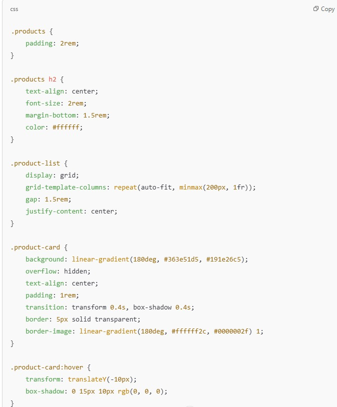

# IP-Project
GUNPLA
Overview
The Gunpla Project is an interactive web platform designed for Gundam model kit enthusiasts. It serves as an online shop where users can explore and purchase Gunpla kits, earn virtual currency through engagement, and redeem vouchers for discounts. The goal is to create an immersive and gamified shopping experience that enhances customer engagement and rewards loyalty.

Design Process
Target Audience:
Gundam enthusiasts who collect and build Gunpla models.
Casual hobbyists looking for beginner-friendly kits.
Competitive builders who participate in Gunpla tournaments.
User Stories:
As a visitor, I want to browse Gunpla kits, so that I can find models that interest me.
As an admin, I want to manage the product inventory, so that I can keep the store updated with the latest kits.
As a visitor i want a clean UI so that it is easy for me to learn to use this website.

Features
Existing Features:
Gunpla Storefront: Allows users to browse available Gunpla kits with descriptions, prices, and images.
Product Details Page: Displays high-quality images, kit specifications, and purchase options.
Shopping Cart System: Users can add/remove items from their cart and proceed to checkout.
User Settings Management - Registered users can update their account settings (username, email, password) and save their changes.
Responsive Design - The website is optimized for various screen sizes, providing a seamless experience on both desktop and mobile devices.

Features Left to Implement:
Leaderboard System: Users compete to earn the most virtual currency.
Community Forum: A space for users to share builds and discuss Gunpla customization.
AR Model Viewer: Allows users to preview Gunpla in augmented reality before purchase.
Virtual Currency System: Users can earn in-game currency by engaging with the site, such as answering daily trivia.
Voucher Redemption: Users can exchange virtual currency for discount vouchers on purchases.
User Authentication: Users can create accounts and track their purchase history.
Checkout function: Users can choose to use the voucher and change the payment method.

Technologies Used
HTML, CSS, JavaScript – Core technologies for building the front-end UI.
Lottie.js – For loading screen animations and interactive elements.
MockAPI-For product and cart function.
ResdDB-For user account registration and login.

Assistive AI
1.Home page Gif layout: help to maintain the height as the same, text aligned with gif.

2.Rremove function: help to add remove api.

3.Total price: help to add caculate total price function.

4.Product card border: help to display the product correctly in both moblie view and desktop view.

User Registration & Login
Update the username, email, and password, and verify that the changes are saved successfully.
Try submitting the settings form with missing required fields and ensure that an error message is displayed.

Product Browsing & Details
Product Display: Navigate to the Gunpla product listing page → All products should be visible with correct images, names, and prices.
View Product Details: Click on a product → The correct name, price, description, and image should be displayed.
Shopping Cart Functionality
Add to Cart: Click "Add to Cart" on a product → The item should appear in the cart with the correct quantity and price.
Remove from Cart: Click "Remove" next to an item → The item should disappear from the cart.
Responsive & Browser Compatibility
Test the site on Chrome and Edge.(Does not display correctly in mobile view on Microsoft Edge.)
Test on mobile (iOS & Android) and desktop to confirm elements scale properly and remain interactive.
API Data Fetching & Performance
Ensure product data loads correctly from the API, displaying accurate details.
Test API response time to ensure product listings load within a reasonable timeframe.
Bug Reports & Known Issues
Does not display correctly in mobile view on Microsoft Edge.
Product detail page is not displaying $ sign.
Footer section is not always at the bottom.

Credits

Media
The photos used in this site were obtained from https://www.pinterest.com/
Acknowledgements
Inspiration for this project from https://www.pinterest.com/pin/281543724428598/ (color combinations)
Inspiration for this project from https://themeskingdom.com/(home page design)

https://github.com/Kx1213/IP-Project.git